# Trace Visualization: Base44 @ Payoneer

**Decision**: DECLINE  
**Timestamp**: 2025-10-30T19:40:16.880459  
**Total Steps**: 6  

## Execution Timeline

```mermaid
gantt
    title Execution Timeline
    dateFormat  X
    axisFormat %S.%Ls
    Cve Search Nvd : 0, 655
    Cve Search Fallback : 655, 2845
    Vulnerability Analysis : 2845, 7781
    Company Search : 7781, 9856
    Software Search : 9856, 11442
    Criticality Analysis : 11442, 13390
```

## Detailed Trace

| Step | Tool | Time (s) | Details |
|------|------|----------|----------|
| 1. cve_search_nvd | nvd_api | 0.66s | 0 results |
| 2. cve_search_fallback | tavily | 2.19s | 5 results |
| 3. vulnerability_analysis | gemini | 4.94s | 13 vulns |
| 4. company_search | tavily | 2.07s | 3 results |
| 5. software_search | tavily | 1.59s | 3 results |
| 6. criticality_analysis | gemini | 1.95s | medium criticality |

## Results

- **Decision**: DECLINE
- **Criticality**: MEDIUM
- **Vulnerability Summary**: Found 13 vulnerabilities for Base44. Includes 10 critical issue(s). Security update cadence: frequent.
