# Trace Visualization: Goshgoha @ Wiz

**Decision**: DECLINE  
**Timestamp**: 2025-10-30T19:39:39.076476  
**Total Steps**: 6  

## Execution Timeline

```mermaid
gantt
    title Execution Timeline
    dateFormat  X
    axisFormat %S.%Ls
    Cve Search Nvd : 0, 713
    Cve Search Fallback : 713, 4740
    Vulnerability Analysis : 4740, 9250
    Company Search : 9250, 10580
    Software Search : 10580, 14024
    Criticality Analysis : 14024, 15443
```

## Detailed Trace

| Step | Tool | Time (s) | Details |
|------|------|----------|----------|
| 1. cve_search_nvd | nvd_api | 0.71s | 0 results |
| 2. cve_search_fallback | tavily | 4.03s | 5 results |
| 3. vulnerability_analysis | gemini | 4.51s | 9 vulns |
| 4. company_search | tavily | 1.33s | 3 results |
| 5. software_search | tavily | 3.44s | 3 results |
| 6. criticality_analysis | gemini | 1.42s | medium criticality |

## Results

- **Decision**: DECLINE
- **Criticality**: MEDIUM
- **Vulnerability Summary**: Found 9 vulnerabilities for Goshgoha. Includes 5 high severity issue(s). Security update cadence: unknown.
