# Trace Visualization: Langflow @ NVIDIA

**Decision**: DECLINE  
**Timestamp**: 2025-10-30T19:36:42.882412  
**Total Steps**: 6  

## Execution Timeline

```mermaid
gantt
    title Execution Timeline
    dateFormat  X
    axisFormat %S.%Ls
    Cve Search Nvd : 0, 650
    Cve Search Fallback : 650, 1344
    Vulnerability Analysis : 1344, 6797
    Company Search : 6797, 7404
    Software Search : 7404, 8041
    Criticality Analysis : 8041, 9561
```

## Detailed Trace

| Step | Tool | Time (s) | Details |
|------|------|----------|----------|
| 1. cve_search_nvd | nvd_api | 0.65s | 0 results |
| 2. cve_search_fallback | tavily | 0.69s | 5 results |
| 3. vulnerability_analysis | gemini | 5.45s | 8 vulns |
| 4. company_search | tavily | 0.61s | 3 results |
| 5. software_search | tavily | 0.64s | 3 results |
| 6. criticality_analysis | gemini | 1.52s | medium criticality |

## Results

- **Decision**: DECLINE
- **Criticality**: MEDIUM
- **Vulnerability Summary**: Found 8 vulnerabilities for Langflow. Includes 3 critical issue(s). Includes 2 high severity issue(s). Security update cadence: moderate.
