# Trace Visualization: Okta Workforce Identity @ Citi Bank

**Decision**: DECLINE  
**Timestamp**: 2025-10-30T19:38:55.574458  
**Total Steps**: 6  

## Execution Timeline

```mermaid
gantt
    title Execution Timeline
    dateFormat  X
    axisFormat %S.%Ls
    Cve Search Nvd : 0, 654
    Cve Search Fallback : 654, 4995
    Vulnerability Analysis : 4995, 8826
    Company Search : 8826, 10955
    Software Search : 10955, 12472
    Criticality Analysis : 12472, 15091
```

## Detailed Trace

| Step | Tool | Time (s) | Details |
|------|------|----------|----------|
| 1. cve_search_nvd | nvd_api | 0.65s | 0 results |
| 2. cve_search_fallback | tavily | 4.34s | 5 results |
| 3. vulnerability_analysis | gemini | 3.83s | 7 vulns |
| 4. company_search | tavily | 2.13s | 3 results |
| 5. software_search | tavily | 1.52s | 3 results |
| 6. criticality_analysis | gemini | 2.62s | high criticality |

## Results

- **Decision**: DECLINE
- **Criticality**: HIGH
- **Vulnerability Summary**: Found 7 vulnerabilities for Okta Workforce Identity. Includes 4 high severity issue(s). Security update cadence: moderate.
