# Trace Visualization: Tiles @ Shopify

**Decision**: DECLINE  
**Timestamp**: 2025-10-30T19:41:02.929149  
**Total Steps**: 6  

## Execution Timeline

```mermaid
gantt
    title Execution Timeline
    dateFormat  X
    axisFormat %S.%Ls
    Cve Search Nvd : 0, 692
    Cve Search Fallback : 692, 3827
    Vulnerability Analysis : 3827, 7545
    Company Search : 7545, 9020
    Software Search : 9020, 10860
    Criticality Analysis : 10860, 12737
```

## Detailed Trace

| Step | Tool | Time (s) | Details |
|------|------|----------|----------|
| 1. cve_search_nvd | nvd_api | 0.69s | 0 results |
| 2. cve_search_fallback | tavily | 3.14s | 5 results |
| 3. vulnerability_analysis | gemini | 3.72s | 5 vulns |
| 4. company_search | tavily | 1.48s | 3 results |
| 5. software_search | tavily | 1.84s | 3 results |
| 6. criticality_analysis | gemini | 1.88s | medium criticality |

## Results

- **Decision**: DECLINE
- **Criticality**: MEDIUM
- **Vulnerability Summary**: Found 5 vulnerabilities for Tiles. Includes 3 high severity issue(s). Security update cadence: frequent.
