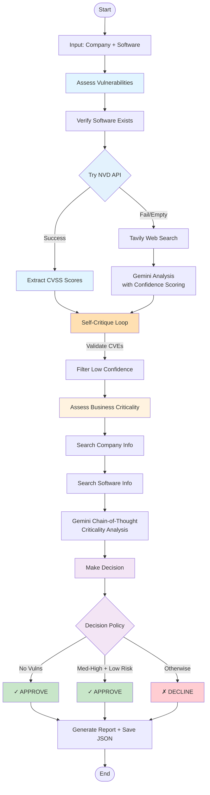

# Workflow Graph Visualization

## Workflow Steps

1. **assess_vulnerabilities** - Check CVEs using NVD API (primary) or Tavily (fallback)
   - Extracts CVSS numeric scores for severity classification
   - Assigns confidence scores to each CVE match (high/medium/low)
   - Validates matches with self-critique loop to prevent false positives
   - Filters out low-confidence matches automatically

2. **assess_criticality** - Determine business importance using web search + LLM
   - Uses chain-of-thought reasoning for explainable assessments
   - Analyzes company business, software purpose, and operational impact
   
3. **make_decision** - Apply deterministic policy rules
   - Rule 1: No vulnerabilities → APPROVE
   - Rule 2: Med-High criticality + Low risk only → APPROVE  
   - Rule 3: Otherwise → DECLINE

## Tools Used

- **NVD API** - Authoritative CVE database with CVSS scores
- **Tavily** - AI-optimized web search
- **Gemini** - Google's LLM for analysis (temperature=0 for determinism)
- **LangGraph** - Workflow orchestration
